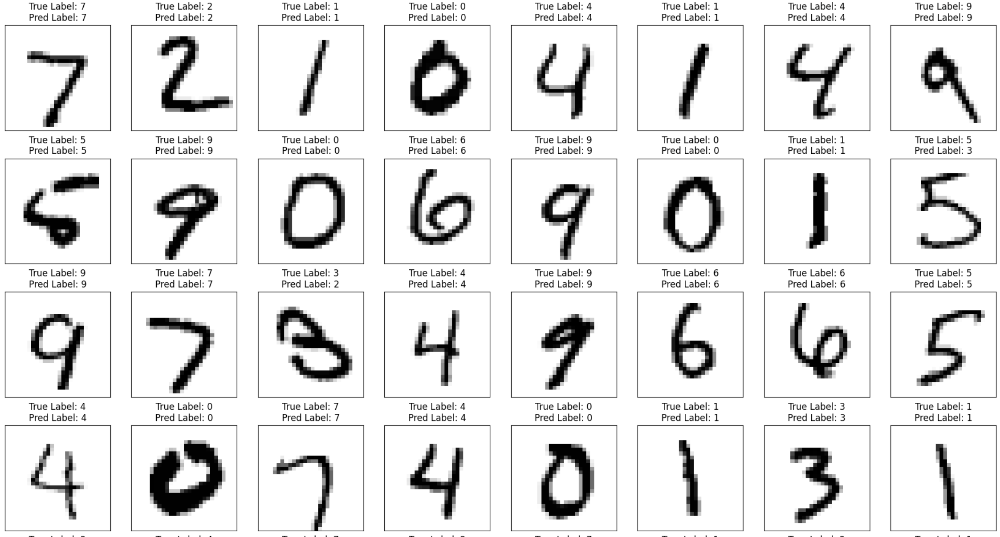
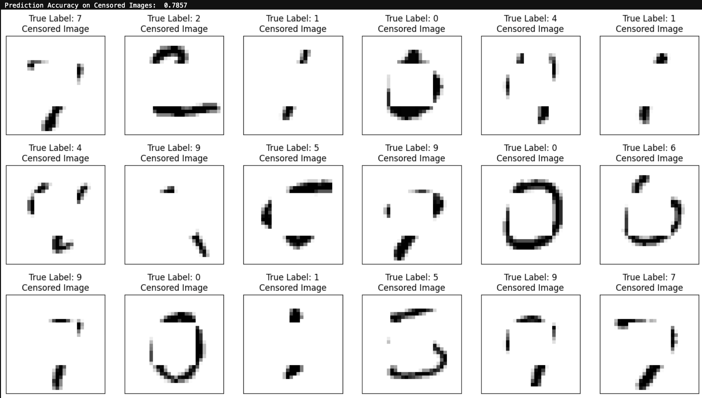
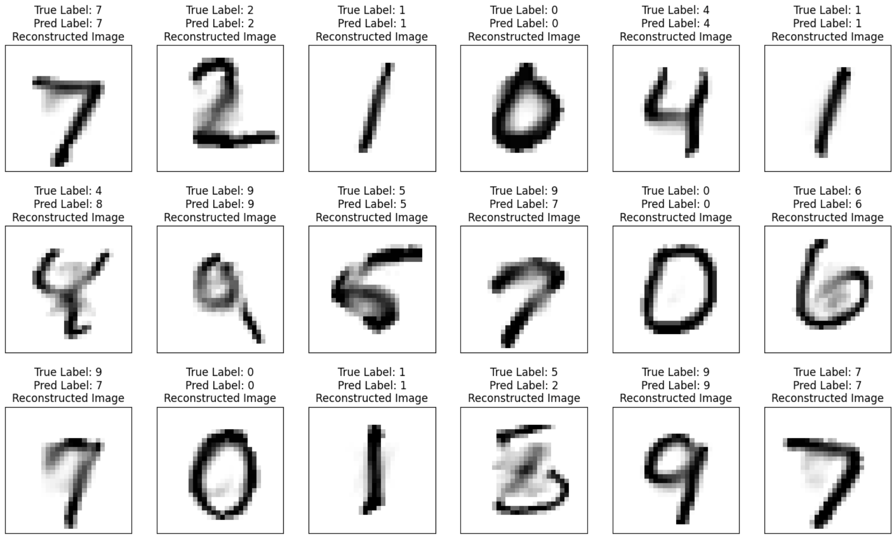

# Generative Digit Classification & Missing Feature Reconstruction

[](https://yann.lecun.com/exdb/mnist/)

This project explores **generative machine learning models** for handwritten digit classification and reconstruction using the MNIST dataset.  
It focuses on Gaussian models, Gaussian Mixture Models, Expectation-Maximization, and missing pixel reconstruction using conditional probability.<br>
This project repository was developed as part of the **CS771: Introduction to Machine Learning** course at the **Indian Institute of Technology Kanpur (IITK)** under **Professor Purushottam Kar**.

---

## Project Overview

Instead of directly learning decision boundaries between digit classes, this project models the probability distribution of each digit class:

$$
P(X \mid Y)
$$

Using these learned distributions, the model can classify digits, discover handwriting styles, and reconstruct missing parts of digit images.

---

## Mathematical Concepts Involved

### 1. Generative Classification

Each digit class is modeled using a multivariate Gaussian distribution.

$$
P(X \mid Y = c)
$$

A test image is classified by choosing the digit class with the highest likelihood.

---

### 2. Multivariate Gaussian Distribution

A digit image is treated as a high-dimensional vector.  
The Gaussian model uses a mean vector and covariance matrix to capture the structure of pixel values.

$$
X \sim \mathcal{N}(\mu, \Sigma)
$$

---

### 3. Gaussian Mixture Model

A single Gaussian may not represent all handwriting styles well.  
A Gaussian Mixture Model represents data using multiple Gaussian components.

$$
P(X) = \sum_{k=1}^{K} \pi_k \mathcal{N}(X \mid \mu_k, \Sigma_k)
$$

---

### 4. Expectation-Maximization Algorithm

EM is used to estimate the parameters of a Gaussian Mixture Model.

- **E-Step:** Estimate the probability that each data point belongs to each Gaussian component.
- **M-Step:** Update the mean, covariance, and mixture weights using those probabilities.

---

### 5. Missing Feature Reconstruction

When some pixels are removed from an image, conditional Gaussian distributions are used to estimate the missing values.

$$
P(X_{\text{missing}} \mid X_{\text{observed}})
$$

This allows the model to reconstruct censored or incomplete digit images.

---

## Experiments Performed

### 1. Fitting a Single Gaussian Model

In this experiment, a single multivariate Gaussian distribution was fitted to digit images.  
Each image was treated as a high-dimensional vector, and the model estimated a mean vector and covariance matrix for the data.

**Conclusion:**  
A single Gaussian gives a rough average representation of the digit data, but it fails to capture different handwriting styles. Since MNIST digits have large variation in shape, thickness, and orientation, one Gaussian is not expressive enough.

---

### 2. Fitting Multiple Gaussians

To better model the variation in handwritten digits, multiple Gaussian distributions were used.  
Each Gaussian component captures a different style or pattern present in the digit images.


**Conclusion:**  
Multiple Gaussians represent the data better than a single Gaussian. They can capture different modes in the dataset, such as slanted digits, thick digits, thin digits, and different writing styles.

---

### 3. Gaussian Mixture Model using EM Algorithm

A Gaussian Mixture Model was trained using the Expectation-Maximization algorithm.  
The EM algorithm alternates between assigning soft cluster probabilities and updating Gaussian parameters.


**Conclusion:**  
The GMM successfully discovers hidden patterns in the data without using explicit style labels. The learned components show that generative models can separate different handwriting styles in an unsupervised way.

---

### 4. Generative Digit Classification

A generative classifier was built by fitting probability distributions for each digit class.  
For a test image, the model calculates the likelihood under each digit class and predicts the class with the highest probability.


**Conclusion:**  
The generative classifier is able to classify MNIST digits by modeling class-wise data distributions. Although it may not perform as well as modern neural networks, it provides a strong probabilistic interpretation of classification.

---

### 5. Missing Pixel Censoring

In this experiment, a part of each digit image was removed or censored.  
The goal was to test whether the model could use the visible pixels to infer the missing region.


**Conclusion:**  
Censoring important pixels makes classification harder because the central region often contains key digit structure. This experiment shows how missing features can reduce the amount of useful information available to the model.

---

### 6. Missing Feature Reconstruction

The missing pixels were reconstructed using conditional Gaussian distributions.  
The model estimated the missing region based on the observed pixels and the learned covariance structure.


**Conclusion:**  
Conditional Gaussian reconstruction can recover meaningful digit shapes from incomplete images. The reconstructed digits are not always perfect, but they preserve important structural information and show the usefulness of probabilistic modeling.

---

## Repository Structure

```text
GENERATIVE-CLASSIFICATION/
├── Generative_Classification_and_Pixel_Reconstruction.ipynb
├── README.md
├── cs771/
│   ├── __init__.py
│   ├── plotData.py
│   └── utils.py
├── mnist/
│   ├── train-images.idx3-ubyte
│   ├── train-labels.idx1-ubyte
│   ├── t10k-images.idx3-ubyte
│   └── t10k-labels.idx1-ubyte
└── images/
    ├── classification_results.png
    ├── missing_pixel_digits.png
    └── reconstructed_digits.png
```

---

## Requirements

Install the required Python libraries:

```bash
pip install numpy matplotlib scikit-learn jupyter
```

---

## How to Run

Clone the repository:

```bash
git clone https://github.com/<your-username>/GENERATIVE-CLASSIFICATION.git
cd GENERATIVE-CLASSIFICATION
```

Launch Jupyter Notebook:

```bash
jupyter notebook
```

Open and run:

```text
Generative_Classification_and_Pixel_Reconstruction.ipynb
```

---

## Results and Conclusions

### Generative Classification

<p align="center">
  
</p>

The Generative Gaussian Classifier models each digit class using a Gaussian distribution and predicts labels using the Maximum A Posteriori (MAP) rule. The model achieved a **test accuracy of 85.73%** on the MNIST dataset.

---

### Missing Feature Reconstruction

<p align="center">
  
</p>
<p align="center">
  
</p>

Using conditional Gaussian inference, the model successfully reconstructed missing pixels from censored images. Even after censoring approximately **21%** of the central pixels, the classifier achieved **78.57%** accuracy, demonstrating the robustness of probabilistic generative models.

---


### Conclusions

- Achieved **85.73%** classification accuracy on the MNIST test set using a **Generative Gaussian Classifier**.
- Even after censoring approximately **21%** of the central pixels, the classifier achieved **78.57%** accuracy, demonstrating the robustness of generative models to missing features.
- **Gaussian Mixture Models (GMMs)** effectively captured multiple handwriting styles, producing more realistic and diverse digit samples than a single Gaussian.
- The **Expectation-Maximization (EM)** algorithm successfully learned latent Gaussian components without explicit style labels.
- Conditional Gaussian inference enabled accurate **missing feature reconstruction**, demonstrating that generative models can perform both **classification** and **feature imputation** within a unified probabilistic framework.

---

## Acknowledgement

This project was developed using the **MNIST** dataset as part of the **CS771: Introduction to Machine Learning** course at the **Indian Institute of Technology Kanpur (IIT Kanpur)** under the guidance of **Professor Purushottam Kar**.